# 矩阵在数字图像中的应用（PCA人脸识别）

### 理论分析

#### 1. 构造数据矩阵 
假设有 M 张人脸图像，每张图像表示为长度为 d 的列向量 $\mathbf{x}_i \in \mathbb{R}^d$
首先计算平均脸（Mean Face）:

$$
\boldsymbol{\Psi} = \frac{1}{M} \sum_{i=1}^{M} \mathbf{x}_i
$$

计算每张脸与平均脸的偏差（去中心化）:

$$
\boldsymbol{\Phi}_i = \mathbf{x}_i - \boldsymbol{\Psi}
$$

将这些偏差向量作为列构造数据矩阵 A:

$$
A = [ \boldsymbol{\Phi}_1, \boldsymbol{\Phi}_2, \dots, \boldsymbol{\Phi}_M ] \in \mathbb{R}^{d \times M}
$$

#### 2. 协方差矩阵
样本的协方差矩阵 C 可以表示为数据矩阵 A 与其转置的乘积:

$$
C = \frac{1}{M-1} \sum_{i=1}^{M} \boldsymbol{\Phi}_i \boldsymbol{\Phi}_i^T = \frac{1}{M-1} A A^T \in \mathbb{R}^{d \times d}
$$

#### 3. 特征值分解
对协方差矩阵 C 进行特征值分解:

$$
C \mathbf{u}_l = \lambda_l \mathbf{u}_l
$$

由于 d 通常很大，我们通过求解 $A^T A$ 的特征向量 $\mathbf{v}_l$ 来简化计算:

$$
(A^T A) \mathbf{v}_l = \mu_l \mathbf{v}_l
$$
由此推导出 C 的特征向量（特征脸）:

$$
\mathbf{u}_l = A \mathbf{v}_l
$$

选取前 k 个最大特征值对应的特征向量构成特征空间基矩阵 $U_k$:

$$
U_k = [ \mathbf{u}_1, \mathbf{u}_2, \dots, \mathbf{u}_k ] \in \mathbb{R}^{d \times k}
$$

#### 4. 投影与降维
对于任意去中心化后的图像向量 $\boldsymbol{\Phi}$，其在特征空间中的投影（即低维表示）通过投影算子的转置相关部分计算:

$$
\boldsymbol{\Omega} = U_k^T \boldsymbol{\Phi}
$$

其中 $\boldsymbol{\Omega} = [ \omega_1, \omega_2, \dots, \omega_k ]^T$ 为该图像在特征脸基下的坐标

### 奇异值分解（SVD）的简化计算

为了避免直接对维度极高的协方差矩阵 $C = \frac{1}{M-1}AA^T$ 进行特征值分解，我们可以直接对去中心化后的数据矩阵 $A \in \mathbb{R}^{d \times M}$ 进行奇异值分解:

$$
A = U \Sigma V^T
$$

其中：
- $U = [ \mathbf{u}_1, \mathbf{u}_2, \dots, \mathbf{u}_d ] \in \mathbb{R}^{d \times d}$ 是左奇异向量矩阵，其列向量是正交的
- $\Sigma \in \mathbb{R}^{d \times M}$ 是对角矩阵，对角线元素 $\sigma_i$ 为奇异值
- $V \in \mathbb{R}^{M \times M}$ 是右奇异向量矩阵

#### 1. 左奇异向量与协方差矩阵特征向量的关系
将 $A$ 的 SVD 形式代入协方差矩阵的表达式:

$$
C = \frac{1}{M-1} A A^T = \frac{1}{M-1} (U \Sigma V^T)(U \Sigma V^T)^T
$$

利用矩阵转置性质 $(BC)^T = C^T B^T$ 及 $V^T V = I$（正交性）:

$$
C = \frac{1}{M-1} U \Sigma V^T V \Sigma^T U^T = \frac{1}{M-1} U (\Sigma \Sigma^T) U^T
$$

由此可见，$C$ 的形式符合特征值分解的定义 $C = U \Lambda U^T$。这证明了:
**数据矩阵 $A$ 的左奇异向量 $U$ 正是协方差矩阵 $C$ 的特征向量（即特征脸）**

#### 2. 特征值与奇异值的关系
协方差矩阵的特征值 $\lambda_i$ 与数据矩阵的奇异值 $\sigma_i$ 存在如下关系:

$$
\lambda_i = \frac{\sigma_i^2}{M-1}
$$

#### 3. 计算优势
在人脸识别中，由于图像维度 $d$ 远大于样本数 $M$，直接对 $A$ 进行 SVD 分解（或截断 SVD）相比于显式计算 $AA^T$ 具有以下优点:
1. **数值稳定性**：SVD 算法在处理近奇异矩阵时比特征值分解更稳健。
2. **计算效率**：成熟的 SVD 算法（如分治法）可以高效地只计算前 $k$ 个最大的奇异值及其对应的左奇异向量 $U_k$，直接构建特征空间基矩阵:

$$
U_k = [ \mathbf{u}_1, \mathbf{u}_2, \dots, \mathbf{u}_k ]
$$

### 实验展示

#### 1. 平均脸
所有训练样本的平均值，代表了该人脸库的共同特征
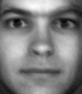

#### 2. 特征值以及对应的特征脸

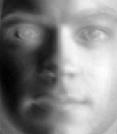 
<small>λ=42587680.0</small>

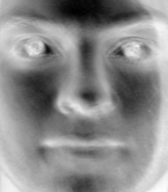 
<small>λ=21281902.0</small>

 
<small>λ=7886554.0</small>

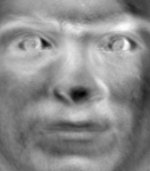 
<small>λ=4789814.0</small>

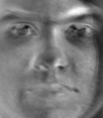 
<small>λ=2504138.25</small>

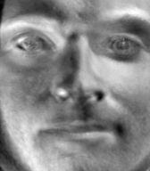 
<small>λ=1492121.5</small>

 
<small>λ=1256461.25</small>

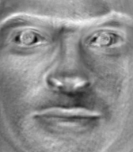 
<small>λ=1058738.25</small>

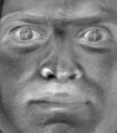 
<small>λ=864673.0</small>

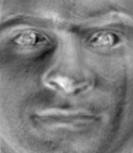 
<small>λ=744577.88</small>

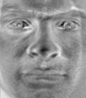 
<small>λ=581877.19</small>

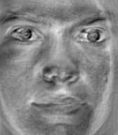 
<small>λ=531729.25</small>

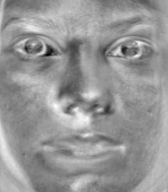 
<small>λ=483631.72</small>

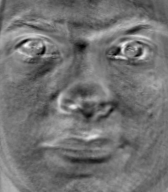 
<small>λ=394392.5</small>

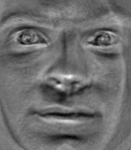 
<small>λ=280139.0</small>

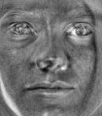 
<small>λ=253026.55</small>

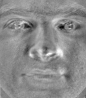 
<small>λ=232007.06</small>

#### 3. 识别结果

取前17个特征值及其对应的特征向量，识别结果达到百分之百（train: 30 + test: 11, 不信跑C++代码）

#### 4. 重建对比图
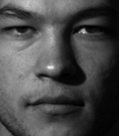
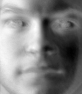